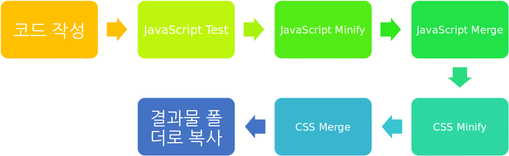

## gulp 시작하기

gulp.js을 시작하기 위해 필요한 가장 기본적인 사용 방법들을 정리했습니다.


#### gulp 개념
gulp 는 node.js 기반의 task runner 입니다. 반복적인 귀찮은 작업들이나 프론트엔드 빌드에 필요한 작업들을 gulp 통해 쉽게 처리해줄 수 있습니다.



Gulp 는 스스로를 Stream 기반의 Build System 이라고 소개하고 있습니다.

요청 후 한번에 결과를 받는 것이 아니라 이벤트로 중간중간 전달받는 방식을 stream이라고 하는데,
이 stream 을 기반으로 하고 있기 때문에 가장 node.js 의 강점을 잘 살리고 있고 실제로 작업 속도도 비교적 더 빠른 것으로 알려져 있습니다.


gulp 의 task 는 pipe 로 연결되는데, 작업 대상 파일들이 pipe 를 따라 흘러가며(stream) 병렬로 동시에 여러 task를 수행하게 됩니다. gulp 라는 이름과 빨대가 꽂힌 컵모양의 심볼이 gulp 의 특징을 잘 반영하고 있다고 볼 수 있습니다.


#### gulp 설치하기

gulp 를 사용하기에 앞서 node.js 와 npm 이 먼저 미리 설치되어 있어야 합니다. node.js 와 npm 이 설치되었다면, 먼저 아래와 같이 package.json 파일을 생성해줍니다.

```bash
$ npm init
```

package.json 파일이 생성되었다면, 아래와 같이 gulp 를 global 과 local 모두 설치해줍니다.

```bash
$ npm install --global gulp-cli
$ npm install --save-dev gulp
```

--save-dev 옵션으로 설치해주는 이유는, 대부분 gulp 가 production 이 아닌 개발 과정에서만 필요하기 때문에, NODE_ENV 의 값이 production 인 경우 gulp가 설치되지 않도록 하기 위해서 입니다.

이제 이어서 gulp의 설정 파일인 gulpfile.js 을 step1부터 차근차근 따라가며 만들어가보도록 하겠습니다.


#### gulp 한 단계씩 따라해보기
단계별로 gulpfile.js 과 약간의 더미 파일들을 구성해두었습니다. 각 단계에 대한 설명 혹은 주석을 참고해서 직접 실행도 해보고 수정도 해보면 gulp 사용법을 익히는데 도움이 될 것입니다.

각 단계들을 바로 실행해보고 싶다면, 먼저 gulp-step-by-step 저장소를 아래와 같이 clone 합니다.

```bash
$ git clone https://github.com/eu81273/gulp-step-by-step.git
```

clone 받은 저장소의 원하는 예제가 위치한 폴더로 이동한 후, package.json 파일에 설정된 디펜던시들을 설치합니다.

```bash
$ cd gulp-step-by-step
$ cd step01_hello_world
$ npm install
```

디펜던시 설치가 완료된 후 각 예제의 설명을 따라 gulp 를 실행하면 예제의 결과를 확인해 볼 수 있습니다.
(아래의 예는 step 01 을 실행하는 예입니다.)

```bash
$ gulp hello
```


- [Step 01. 가장 단순한 기본 형태](./step01_hello_world)
- [Step 02. 기본 Task 설정하기](./step02_default_task)
- [Step 03. 순차적으로 Task 실행하기](./step03_series)
- [Step 04. JavaScript 파일 Minify 하기](./step04_uglify)
- [Step 05. 파일이 변경되면 자동으로 Task 실행하기](./step05_watch)
- [Step 06. 여러 파일 병합하기 형태](./step06_concat)
- [Step 07. CSS 파일 Minify 하기](./step07_css_minify)
- [Step 08. BrowerSync로 미니 서버를 띄워서 작업하기](./step08_browser_sync)
- [Step 09. Browserify로 모듈 번들링하기](./step09_browserify)
- [Step 10. 소스맵 사용하기](./step10_sourcemaps)
- [Step 11. 증분 빌드 적용하기](./step11_incremental_build)
- [Step 12. plumber로 오류처리하기](./step12_plumber)
- [Step 13. runSequence를 사용해서 직렬/병렬로 실행하기](./step13_run_sequence)
- [Step 14. Browserify 로 React 번들링하기](./step14_react)
- [Step 15. 다중 엔트리 React + Browserify + Watchify + Babel 빌드하기](./step15_watchify)
- [Step 16. 수행할 작업을 메뉴에서 선택해서 실행하기](./step16_select_task)
- [Step 17. Webpack 으로 React 번들링하기](./step17_webpack)
- [Step 18. SASS(SCSS) 컴파일하고 자동으로 프리픽스 추가하기](./step18_sass)

#### Gulp 를 활용하는데 도움이 되는 링크들
- [Gulp Recipes](https://github.com/gulpjs/gulp/tree/master/docs/recipes)
- [Gulp Cheatscheet](https://github.com/osscafe/gulp-cheatsheet)
