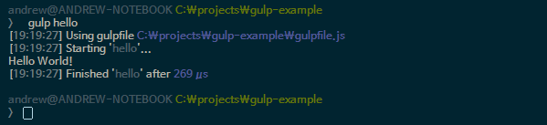

## STEP 1. Hello World

무언가 새로운 것을 배울 때는 가장 단순한 기본 형태를 보는 것이 가장 빠르게 이해하는 길입니다.
gulp의 설정파일인 gulpfile.js 의 가장 단순한 형태는 아래와 같습니다. 특별한 기능은 하지 않고 Hello World 라는 내용만 콘솔에 찍어주는 하나의 task로만 구성되어 있습니다.

```javascript
var gulp = require('gulp');

// hello world 라고 콘솔에 찍는 task
gulp.task('hello', function () {
	return console.log('Hello World!');
});
```

#### gulp.task
gulp.task 메서드는 새로운 gulp task 를 등록해주는 역할을 합니다.
가장 기본적인 형태에서는 첫번째 파라메터에 task 이름, 두번째 파라메터에 실제 작업할 내용이 함수가 위치하게 됩니다.

이제 gulpfile.js 파일에 설장한 hello 라는 task는 아래와 같이 실행할 수 있습니다.

```bash
$ gulp hello
```

hello 라는 task 를 실행하면 아래와 같이 'Hello world!' 라는 메시지만 출력하고 종료되는 것을 볼 수 있습니다.


