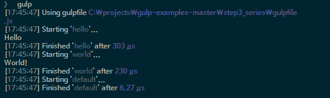

## STEP 3. Series Tasks

기본적으로 gulp는 여러개의 task들을 동시에 병렬로 수행하도록 설계되어 있지만, 다른 task가 먼저 수행된 이후에 수행이 되어야하는 task가 있을 수 있습니다.
이러한 task 간의 dependency는 생각보다 간단하게 해결할 수 있습니다.

```javascript
var gulp = require('gulp');

// hello 라고 콘솔에 찍는 task
gulp.task('hello', function () {
	return console.log('Hello');
});

// world 라고 콘솔에 찍는 task, hello 라는 task가 먼저 완료된 뒤에만 실행된다.
gulp.task('world', ['hello'], function () {
	return console.log('World!');
});

//gulp를 실행하면 default 로 world task를 실행
gulp.task('default', ['world']);
```

이번에는 task 가 총 두 개인데, 하나는 'Hello' 라는 메시지를 출력하는 hello task 이고, 또 하나는 'World!' 라는 메시지를 출력하는 world task 입니다.

world task 보다 hello task 가 먼저 실행되도록 하는 것은 간단합니다. world task 를 선언한 부분을 보면, 두번째 파라메터에 `['hello']` 가 추가되어 있는데, 이렇게 두번째 파라메터에 먼저 수행되어야할 task들의 이름을 배열 형태로 넣어두면 해당 task들을 먼저 수행한 후에 해당 task를 수행하게 됩니다.


```bash
$ gulp
```

기본값으로 world 라는 task 를 실행하도록 했지만, 실제로 실행될 때는 dependency 설정으로 hello task가 먼저 실행되고 world task가 이후에 실행되는 것을 볼 수 있습니다.


