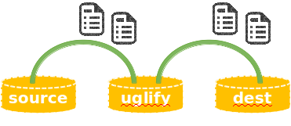

## STEP 4. JavaScript Minify(Uglify)

프론트엔드 빌드 과정 중에 가장 빈번하게 하는 작업 중 하나는 JavaScript 파일을 Minify(혹은 Uglify, 난독화)하는 작업입니다.
JavaScript 파일에 포함된 주석, 공백 등을 제거하고 변수명 등을 짧게 바꾸는 등의 작업을 거쳐 용량을 줄이고 JavaScript Engine 이 보다 빠르게 JavaScript 파일을 해석할 수 있도록 도와주게 됩니다.

이러한 JavaScript Minify 작업을 해주는 많은 Gulp 플러그인 들이 존재하는데, 여기에서는 그 플러그인들 중 gulp-uglify 라는 플러그인을 사용해서 해당 작업을 수행할 예정입니다.
먼저 npm 을 사용해서 gulp-uglify 플러그인을 설치해줍니다.

```bash
$ npm install gulp-uglify --save-dev
```

이제 본격적으로 플러그인을 사용해서 직접 파일을 다루는 빌드 작업을 시작해보도록 하겠습니다.


```javascript
var gulp = require('gulp');
var uglify = require('gulp-uglify');

//자바스크립트 파일을 minify
gulp.task('uglify', function () {
	return gulp.src('src/*.js') //src 폴더 아래의 모든 js 파일을
		.pipe(uglify()) //minify 해서
		.pipe(gulp.dest('dist')); //dist 폴더에 저장
});

//gulp를 실행하면 default 로 uglify task를 실행
gulp.task('default', ['uglify']);
```

이번에는 평소와는 다르게 'gulp.src' 와 'pipe', 'gulp.dest' 라는 키워드들이 눈에 들어옵니다.


#### gulp.src
gulp.src 는 해당 task의 대상이 되는 파일들을 지정해주는 역할을 합니다.
파일을 선택하는 방식은 [node-glob](https://github.com/isaacs/node-glob/) 의 문법을 따릅니다.

```javascript
//src 하위의 모든 디렉토리의 js 확장자를 가진 파일
'src/**/*.js'
//foo 디렉토리와 bar 디렉토리에서 js 확장자를 가진 파일
['foo/*.js', 'bar/*.js']
```


#### gulp.dest
gulp.dest 는 해당 task의 결과물이 저장될 경로를 지정합니다.


#### pipe
pipe 는 gulp.src 에서 대상으로 지정된 각 파일들을 stream 형태로 읽어들여서 다음으로 거쳐야할 플러그인 등으로 연결할 때 사용하게 됩니다. 아래의 이미지에서 초록색 라인이 pipe의 기능이라고 보시면 좀더 이미지화하는데 도움이 될 수 있습니다.




default task 로 uglify 를 지정했기 때문에 아래와 같이 gulp 라고만 입력해도 uglify task가 실행되게 됩니다.

```bash
$ gulp
```

gulp-uglify 플러그인을 사용하면 아래와 같이 각 파일들이 minify 되어서 dist 디렉토리에 동일한 파일명으로 생성된 것을 볼 수 있습니다.


다른 다양한 플러그인들도 결국 이 gulp-uglify 플러그인과 사용방법이 비슷하기 때문에 해당 플러그인이 제공하는 설명을 참조해서 약간만 수정해주면 거의 대부분의 플러그인을 적용하는데 큰 문제가 없을 것입니다.
