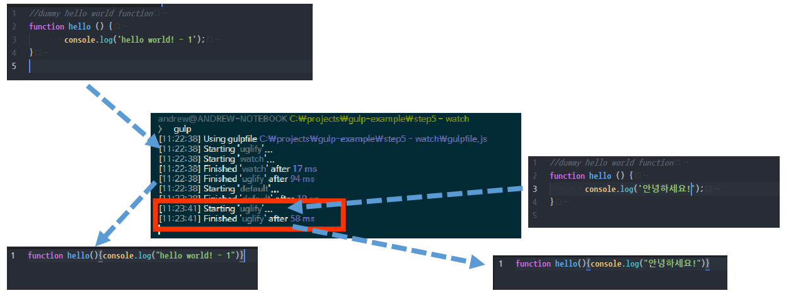

## STEP 5. Watch

앞서 gulp-uglify 플러그인을 사용해서 JavaScript 파일을 Minify 하는 방법에 대해서 살펴 보았습니다.
그런데 한 두번은 괜찮지만, 개발 과정에서는 자잘한 변경이 많을 수 밖에 없는데, 매번 JavaScript 파일을 수정할 때마다 `gulp` 를 타이핑해서 task 를 실행하는 것은 비효율적이고 귀찮은 일입니다.


gulp는 이런 경우를 위해, 파일에 변경이 있을 때마다 변경을 감지해서 task 를 실행할 수 있는 기능을 `gulp.watch` 라는 메서드로 제공해주고 있습니다.


```javascript
var gulp = require('gulp');
var uglify = require('gulp-uglify');

//자바스크립트 파일을 minify
gulp.task('uglify', function () {
	return gulp.src('src/*.js') //src 폴더 아래의 모든 js 파일을
		.pipe(uglify()) //minify 해서
		.pipe(gulp.dest('dist')); //dist 폴더에 저장
});

// 파일 변경 감지
gulp.task('watch', function () {
	gulp.watch('src/*.js', ['uglify']);
});

//gulp를 실행하면 default 로 uglify task와 watch task를 실행
gulp.task('default', ['uglify', 'watch']);
```

앞서 살펴본 소스에서 watch 라는 task가 추가되었는데, 이 task를 자세히 살펴보면, `gulp.watch` 메서드를 어떻게 사용해야하는지 알 수 있습니다.


#### gulp.watch
gulp.watch 의 첫번째 파라메터에서는 변경 감지를 해야하는 대상을 지정합니다.
파일을 선택하는 방식은 [node-glob](https://github.com/isaacs/node-glob/) 의 문법을 따릅니다.

두번째 파라메터는 변경이 감지되었을 때 실행할 task 를 지정합니다. 배열 형태로 여러개의 task 명을 넣어주면 변경이 일어날 때마다 해당 task 들을 자동으로 실행해주게 됩니다.

```javascript
gulp.task('watch', function () {
	//src 디렉토리 안에 js 확장자를 가진 파일이 변경되면 uglify task 실행
	gulp.watch('src/*.js', ['uglify']);
});
```


default task 로 uglify 와 watch task 를 지정했기 때문에 아래와 같이 gulp 라고만 입력하면 uglify 와 watch task가 실행되게 됩니다.

```bash
$ gulp
```

이번에는 watch task 도 실행했기 때문에, gulp 가 바로 종료되지 않고 변경 감지를 위해 대기하고 있는 것을 볼 수 있습니다. 이때 src 디렉토리 아래의 js 파일 하나를 수정하면 바로 변경을 감지해서 uglify task를 수행하는 것을 확인할 수 있습니다.


